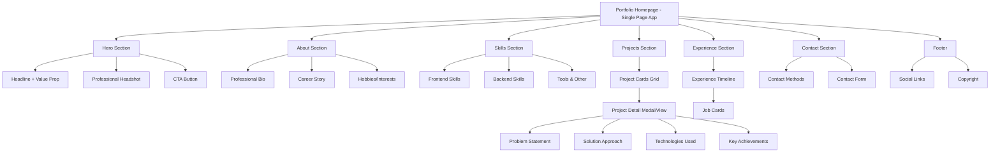
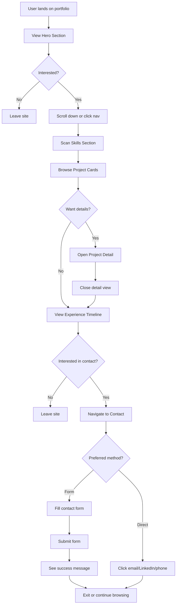
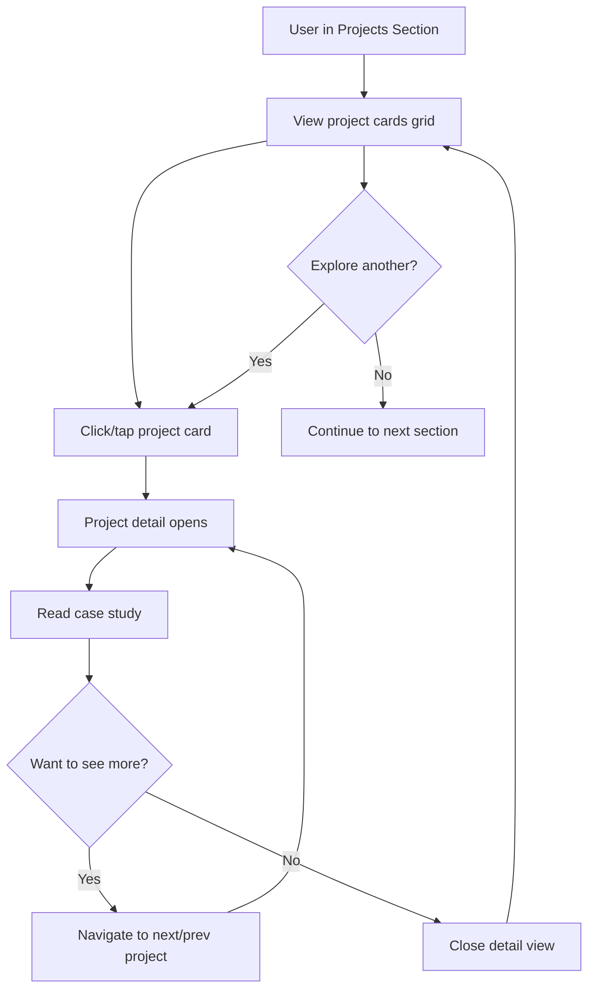
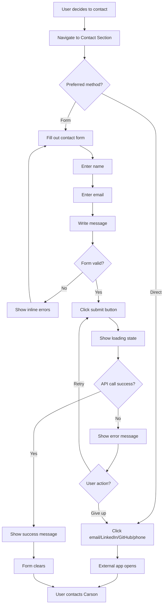

# Carson Antoine - Professional Portfolio Site
## UI/UX Specification

**Version:** 1.0
**Date:** November 5, 2025
**Status:** Draft - In Progress
**Project Type:** Personal Portfolio Website

---

## Introduction

This document defines the user experience goals, information architecture, user flows, and visual design specifications for Carson Antoine's Professional Portfolio Site user interface. It serves as the foundation for visual design and frontend development, ensuring a cohesive and user-centered experience.

### Overall UX Goals & Principles

#### Target User Personas

**Primary Persona: Technical Hiring Manager**
- Senior engineers or engineering managers at tech companies (5-15 years experience)
- Evaluates 10-50 candidates per position
- Spends 2-5 minutes on initial portfolio review
- Values: Code quality, technical depth, clear communication, measurable impact
- Pain points: Limited time, needs quick assessment of capabilities
- Goals: Identify qualified senior engineers, reduce false positives in interview pipeline

**Secondary Persona: Technical Recruiter**
- Internal or agency recruiters managing multiple open positions
- May have technical background but not always hands-on developers
- Needs easy-to-share, scannable candidate profiles
- Values: Clear skill summaries, contact information, differentiation points
- Goals: Build pipeline of qualified candidates, present candidates that pass technical screens

#### Usability Goals

1. **Immediate Value Communication:** Visitor understands Carson's expertise and value proposition within 10 seconds of landing
2. **Effortless Navigation:** Users can find any section within 2 clicks/taps, smooth scroll provides seamless experience
3. **Scannable Content:** Technical skills, experience, and projects are quickly scannable with clear visual hierarchy
4. **Trust Building:** Professional polish and technical excellence demonstrated through implementation quality
5. **Low Friction Contact:** Multiple contact methods reduce barriers to reaching out
6. **Accessibility for All:** WCAG 2.1 AA compliance ensures portfolio is usable by everyone
7. **Performance Excellence:** Sub-3-second load time maintains engagement and demonstrates technical competence

#### Design Principles

1. **Confident Minimalism** - Clean, professional aesthetic that lets content shine. Avoid unnecessary decoration or flashy elements that distract from Carson's work and story.

2. **Progressive Disclosure** - Start with high-level overview (hero, skills summary), allow users to dive deeper into projects and experience as interest grows. Don't overwhelm with information upfront.

3. **Technical Sophistication Through Subtlety** - Demonstrate engineering excellence through smooth animations, perfect typography, optimal performance—not through gimmicks or over-design.

4. **Accessibility as Foundation** - Design for keyboard navigation, screen readers, and color contrast from the start. Accessibility isn't an add-on, it's core to quality.

5. **Content-First Hierarchy** - Visual design serves the content. Carson's achievements, projects, and story are the stars—design is the supporting actor.

### Change Log

| Date | Version | Description | Author |
|------|---------|-------------|--------|
| 2025-11-05 | 1.0 | Initial UI/UX Specification creation | Sally (UX Expert) |

---

## Information Architecture (IA)

### Site Map / Screen Inventory



### Navigation Structure

**Primary Navigation:**
- Fixed/sticky header navigation bar with logo/name on left
- Navigation links: About | Skills | Projects | Experience | Contact
- Smooth scroll to corresponding section on click
- Active state highlighting based on scroll position
- Mobile: Hamburger menu (< 768px) with slide-out drawer

**Secondary Navigation:**
- Footer contains duplicate navigation links for convenience
- "Back to Top" button appears after scrolling past hero section
- Project detail modal/view has close button to return to grid

**Breadcrumb Strategy:**
- Not applicable for single-page application
- URL hash updates based on active section (e.g., `#projects`) for sharing specific sections
- Browser back/forward navigation supported via hash routing

---

## User Flows

### Flow 1: Initial Portfolio Review (Primary Flow)

**User Goal:** Technical hiring manager wants to quickly assess Carson's qualifications and decide whether to proceed with interview process

**Entry Points:**
- Direct URL from job application
- LinkedIn profile link
- Recruiter referral
- Search engine result

**Success Criteria:**
- User understands Carson's expertise within 10 seconds
- User can quickly scan skills, projects, and experience
- User finds contact method to reach out

#### Flow Diagram



#### Edge Cases & Error Handling:

- **Slow connection:** Progressive loading with skeleton screens, critical content loads first
- **JavaScript disabled:** Core content still accessible, graceful degradation
- **Mobile device:** Touch-optimized interactions, hamburger menu, larger tap targets
- **Screen reader:** Proper ARIA labels, skip links, semantic HTML structure
- **Deep link to section:** URL hash navigation works, smooth scroll to target section

**Notes:** This is the most critical flow—optimize for speed and clarity. First 10 seconds are crucial for engagement.

---

### Flow 2: Project Exploration (Secondary Flow)

**User Goal:** User wants to understand Carson's technical depth through detailed project case studies

**Entry Points:**
- From initial review flow (clicked project card)
- Direct link to specific project (shared URL with hash)
- Return visit to explore projects in detail

**Success Criteria:**
- User can easily browse multiple projects
- Project details are comprehensive but scannable
- User understands problem, solution, and impact
- User can return to grid view seamlessly

#### Flow Diagram



#### Edge Cases & Error Handling:

- **No projects loaded:** Display friendly message, check connection
- **Image loading failure:** Show placeholder, alt text visible
- **Modal doesn't close:** ESC key, click outside, close button all work
- **Keyboard navigation:** Tab through projects, Enter to open, ESC to close
- **Mobile swipe:** Swipe left/right to navigate between project details

**Notes:** Project section is the portfolio's centerpiece—ensure smooth, delightful interactions.

---

### Flow 3: Contact Submission (Conversion Flow)

**User Goal:** User wants to reach out to Carson about an opportunity

**Entry Points:**
- Hero CTA button ("Get In Touch")
- Navigation link to Contact section
- Footer contact links
- After reviewing portfolio content

**Success Criteria:**
- User can choose preferred contact method easily
- Form submission is quick and error-free
- User receives clear confirmation of submission
- Alternative contact methods available if form fails

#### Flow Diagram



#### Edge Cases & Error Handling:

- **Form validation errors:** Inline error messages, field-specific feedback, submit disabled until valid
- **API failure:** Clear error message, suggest alternative contact methods (email link)
- **Rate limit exceeded:** Friendly message explaining limit, show direct contact options
- **Network timeout:** Retry option, don't lose form data, show direct contact fallback
- **Spam prevention:** Rate limiting active but invisible to legitimate users

**Notes:** Contact form is critical conversion point—minimize friction, maximize success rate.

---

## Wireframes & Mockups

**Primary Design Files:** To be created in Figma or similar design tool based on these specifications

### Key Screen Layouts

#### 1. Hero Section (Landing)

**Purpose:** Immediately communicate Carson's value proposition and capture visitor attention

**Key Elements:**

**Layout (Desktop 1920px):**
- Full viewport height (100vh)
- Two-column layout: Left (60%) content, Right (40%) headshot image
- Centered vertically with generous whitespace

**Content (Left Column):**
- Small eyebrow text: "Full-Stack Software Engineer" (14px, uppercase, letter-spacing, muted color)
- H1 Headline: "Senior Full-Stack Engineer specializing in .NET, React & Azure" (48-56px, bold, primary color)
- Subheadline: "Building scalable, performant web applications with 5+ years of experience" (20-24px, regular, secondary text color)
- Primary CTA Button: "Get In Touch" (prominent, accent color, hover effect with slight elevation)
- Secondary text: "Scroll to explore" with down arrow icon (subtle, animated bounce)

**Visual (Right Column):**
- Professional headshot (circular or rounded square, 400-500px)
- Subtle shadow or border
- Optional: Floating tech stack icons around image (React, .NET, Azure logos - very subtle)

**Mobile (375px):**
- Single column, stacked layout
- Headshot smaller (250px), positioned above headline
- Headline size reduced (32-36px)
- All content centered
- CTA button full-width or centered

**Interaction Notes:**
- Fade-in animation on load (headline, then subheadline, then CTA - staggered 100ms)
- CTA button smooth scroll to Contact section
- Down arrow gentle bounce animation (CSS keyframes)
- Parallax effect on scroll (optional, subtle)

**Design File Reference:** [To be created: hero-section-desktop.fig, hero-section-mobile.fig]

---

#### 2. About Section

**Purpose:** Tell Carson's career story and humanize the candidate beyond technical skills

**Key Elements:**

**Layout (Desktop):**
- Container max-width 1200px, centered
- Two-column: Left (65%) bio text, Right (35%) hobbies/interests
- Generous padding top/bottom (120px)

**Content (Left Column):**
- Section heading: "About Me" (H2, 36-40px)
- Bio content: 3-4 paragraphs (16-18px, line-height 1.6-1.8)
- Markdown rendered with proper spacing between paragraphs

**Content (Right Column):**
- Subheading: "When I'm Not Coding" (H3, 24px)
- Hobby grid: 2 columns x 3 rows
- Each hobby: Icon + label (Hiking, Snow Skiing, Video Games, Disc Golf, F1, Food & Plants)
- Icons: Lucide React, 32px, accent color

**Mobile (375px):**
- Single column, bio first, hobbies below (3 columns x 2 rows)

**Interaction Notes:**
- Fade-in on scroll, links open in new tab, hobby icons scale on hover

**Design File Reference:** [To be created: about-section.fig]

---

#### 3. Skills Section

**Purpose:** Display technical expertise organized by category for quick scanning

**Key Elements:**

**Layout (Desktop):**
- Three columns: Frontend | Backend | Tools & Other
- Each column: Category heading + skill badges

**Skill Badge Design:**
- Rounded rectangle (border-radius 8px), padding: 12px 20px
- Background: Light gray or subtle gradient
- Text: 14-16px, medium weight
- Optional: Technology icon/logo (16px) + text
- Hover: Slight elevation, accent border

**Mobile (375px):**
- Single column, categories stacked, badges wrap 2 per row

**Interaction Notes:**
- Fade-in on scroll (staggered by column), hover scale 1.02x

**Design File Reference:** [To be created: skills-section.fig]

---

#### 4. Projects Section (Grid View)

**Purpose:** Showcase featured projects with visual appeal

**Key Elements:**

**Layout:** 3 columns (desktop), 2 (tablet), 1 (mobile), gap: 32px

**Project Card:**
- Card with elevation, 16:9 image, content padding: 24px
- Title (H3, 24px), description (2-3 lines), tech badges, "View Details" link

**Card States:**
- Default: Subtle shadow
- Hover: Elevated shadow, scale 1.02x
- Focus: Accent border

**Interaction Notes:**
- Cards fade-in on scroll (staggered), click opens detail view

**Design File Reference:** [To be created: projects-grid.fig]

---

#### 5. Projects Section (Detail View)

**Purpose:** Comprehensive project case study in focused modal

**Key Elements:**

**Layout:** Centered modal (900px max-width), full-screen on mobile

**Content:** Hero image, title, tech badges, sections (Challenge, Solution, Technologies, Achievements, Outcomes)

**Metric Callouts:** Highlighted boxes for key metrics (e.g., "40% faster")

**Interaction Notes:**
- Fade-in + slide-up animation, ESC/backdrop closes, focus trap, scroll locked

**Design File Reference:** [To be created: project-detail-modal.fig]

---

## Component Library / Design System

**Design System Approach:** Create a custom design system built on shadcn/ui foundation, tailored for Carson's portfolio with "Confident Minimalism" aesthetic

### Core Components

#### Button Component

**Purpose:** Primary interactive element for CTAs and actions

**Variants:** Primary (accent bg, white text), Secondary (transparent bg, accent border), Ghost (no bg, text only)

**States:** Default, Hover (elevation, scale 1.02x), Active (scale 0.98x), Focus (accent ring), Disabled (opacity 0.5)

**Usage Guidelines:** Primary for main CTAs (1 per section max), minimum 44x44px tap target, action-oriented text

---

#### Card Component

**Purpose:** Container for grouped content (projects, experience, skills)

**Variants:** Default (subtle border, minimal shadow), Elevated (increased shadow), Bordered (accent border)

**States:** Default, Hover (elevated shadow, scale 1.02x for interactive), Focus (accent border ring), Selected (accent border)

**Usage Guidelines:** Elevated for clickable cards, consistent 12px border-radius, padding 24px (desktop) / 16px (mobile)

---

#### Input Component (Form Fields)

**Purpose:** Text input for contact form

**Variants:** Text, Email, Textarea

**States:** Default (light gray border), Focus (accent border, glow), Error (red border, inline message), Success (green border, checkmark), Disabled

**Usage Guidelines:** Always pair with Label, inline error messages, minimum 44px height

---

#### Badge Component

**Purpose:** Display technologies, tags, status

**Variants:** Default (light gray bg), Accent (accent bg, white text), Outline (transparent bg, border)

**States:** Default, Hover (scale 1.05x if interactive), Active (darker bg for filtering)

**Usage Guidelines:** For tech stacks/skills, concise text (1-2 words), padding 6px 12px (small) / 8px 16px (medium)

---

#### Navigation Component

**Purpose:** Fixed header navigation

**Variants:** Desktop (horizontal), Mobile (hamburger menu)

**States:** Default (semi-transparent, backdrop blur), Scrolled (solid bg, shadow), Link Active (accent color), Link Hover

**Usage Guidelines:** Fixed/sticky position, logo clickable (return to top), active state for current section

---

#### Modal/Dialog Component

**Purpose:** Overlay for project details

**Variants:** Centered (900px max-width), Full-screen (mobile)

**States:** Open (fade-in, backdrop, scroll locked), Closed (fade-out)

**Usage Guidelines:** Close button + ESC key, click backdrop to close, focus trap, padding 40px (desktop) / 24px (mobile)

---

## Branding & Style Guide

### Visual Identity

**Brand Guidelines:** Custom design system for Carson Antoine's portfolio, embodying "Confident Minimalism"

### Color Palette

| Color Type | Hex Code | Usage |
|------------|----------|-------|
| **Primary** | `#1e293b` (Slate 800) | Main text, headlines, primary UI elements |
| **Secondary** | `#475569` (Slate 600) | Secondary text, subheadings, muted content |
| **Accent** | `#06b6d4` (Cyan 500) | CTAs, links, interactive elements, highlights |
| **Success** | `#10b981` (Emerald 500) | Positive feedback, success states |
| **Warning** | `#f59e0b` (Amber 500) | Cautions, important notices |
| **Error** | `#ef4444` (Red 500) | Errors, validation failures |
| **Neutral 50** | `#f8fafc` | Light backgrounds |
| **Neutral 100** | `#f1f5f9` | Card backgrounds |
| **Neutral 200** | `#e2e8f0` | Borders, dividers |
| **Neutral 900** | `#0f172a` (Slate 900) | Deep backgrounds |
| **White** | `#ffffff` | Primary backgrounds |

### Typography

#### Font Families

- **Primary:** Inter (Google Fonts) - Clean, modern sans-serif
- **Monospace:** JetBrains Mono or Fira Code (for code snippets if needed)

#### Type Scale

| Element | Size | Weight | Line Height | Usage |
|---------|------|--------|-------------|-------|
| **H1** | 48px (3rem) | 700 (Bold) | 1.2 | Hero headline |
| **H2** | 36px (2.25rem) | 700 (Bold) | 1.3 | Section headings |
| **H3** | 24px (1.5rem) | 600 (Semibold) | 1.4 | Subsection headings |
| **H4** | 20px (1.25rem) | 600 (Semibold) | 1.4 | Minor headings |
| **Body** | 16px (1rem) | 400 (Regular) | 1.6 | Body text |
| **Body Large** | 18px (1.125rem) | 400 (Regular) | 1.6 | Lead paragraphs |
| **Small** | 14px (0.875rem) | 400 (Regular) | 1.5 | Captions, labels |
| **Tiny** | 12px (0.75rem) | 500 (Medium) | 1.4 | Badges, tags |

**Mobile Adjustments:** H1: 32-36px, H2: 28-32px, H3: 20-22px

### Iconography

**Icon Library:** Lucide React (https://lucide.dev)

**Icon Sizes:** Small (16px), Medium (24px), Large (32px), XL (48px)

**Usage:** Consistent 2px stroke-width, accent color for interactive, always include aria-label

### Spacing & Layout

**Container Max-Widths:** 1280px (xl) primary, 1536px (2xl) maximum

**Spacing Scale (Tailwind):**
- 4: 16px (base unit)
- 6: 24px (medium)
- 8: 32px (large)
- 12: 48px (section padding mobile)
- 16: 64px (section padding tablet)
- 24: 96px (section padding desktop)
- 32: 128px (major section spacing)

**Responsive Breakpoints:** Mobile (375-767px), Tablet (768-1023px), Desktop (1024-1279px), Large (1280px+)

---

## Accessibility Requirements

### Compliance Target

**Standard:** WCAG 2.1 Level AA | **Goal:** Lighthouse Accessibility Score of 100

### Key Requirements

#### Visual
- **Color Contrast:** Body text 4.5:1, large text 3:1, UI components 3:1 (all palette combinations verified ✅)
- **Focus Indicators:** 2px solid accent ring on all interactive elements, 2px offset, never remove focus styles
- **Text Sizing:** Support 200% zoom, relative units (rem/em), responsive sizing

#### Interaction
- **Keyboard Navigation:** All elements accessible via Tab/Enter/Space/Arrow keys, skip links, logical tab order, no traps
- **Screen Reader:** Semantic HTML, proper heading hierarchy (H1→H2→H3), ARIA labels for icons, live regions for updates
- **Touch Targets:** Minimum 44x44px, 8px spacing between targets, visual feedback on touch

#### Content
- **Alt Text:** All images have descriptive alt, decorative images empty alt (`alt=""`), icon buttons have aria-label
- **Heading Structure:** Single H1, logical hierarchy, descriptive headings
- **Form Labels:** Every field has visible `<label>`, required fields indicated, errors associated with fields

### Testing Strategy

**Automated:** axe DevTools, Lighthouse, WAVE, Pa11y in CI/CD

**Manual:**
- Keyboard navigation (Tab through entire page, verify focus indicators)
- Screen readers (VoiceOver on macOS, NVDA on Windows, mobile screen readers)
- Visual testing (200% zoom, high contrast mode, reduced motion)
- Mobile testing (touch targets, zoom/pinch, orientation changes)

**Testing Checklist:** Keyboard accessible, focus visible, contrast meets standards, alt text present, heading hierarchy logical, form labels associated, ARIA correct, screen reader announces properly, no keyboard traps, touch targets 44x44px, works at 200% zoom, reduced motion respected

---

## Responsiveness Strategy

### Breakpoints

| Breakpoint | Min Width | Max Width | Target Devices | Container Width |
|------------|-----------|-----------|----------------|-----------------|
| **Mobile** | 375px | 767px | iPhone, Android phones | Full width (16px padding) |
| **Tablet** | 768px | 1023px | iPad, Android tablets | 720px |
| **Desktop** | 1024px | 1279px | Laptops, small desktops | 960px |
| **Large** | 1280px | - | Large desktops | 1200px |

### Adaptation Patterns

**Layout Changes:**
- **Mobile:** Single column, stacked sections, full-width components, reduced padding (16px)
- **Tablet:** Two columns where appropriate, better spacing
- **Desktop:** Multi-column (2-3), side-by-side layouts, generous spacing

**Navigation Changes:**
- **Mobile:** Hamburger menu, slide-out drawer, large tap targets (48px)
- **Tablet:** Hamburger or full nav (depends on link count)
- **Desktop:** Full horizontal nav, hover states, active highlighting

**Content Priority (Mobile):** Hero → About → Skills → Projects → Experience → Contact

**Interaction Changes:**
- **Mobile:** Touch gestures, 44px+ tap targets, no hover (active/focus only), full-screen modals
- **Desktop:** Hover effects, cursor changes, keyboard shortcuts, centered modals with backdrop
- **Tablet:** Hybrid (touch + mouse support)

**Responsive Images:** Next.js Image with multiple sizes, WebP format, lazy loading, blur placeholders

---

## Animation & Micro-interactions

### Motion Principles

**Philosophy:** Animations enhance understanding and delight, never distract or slow down

**Core Principles:** Purposeful motion, subtle & fast (150-300ms), performance first (GPU-accelerated), respect `prefers-reduced-motion`, natural easing

**Easing Functions:** Ease-out (entrances), Ease-in (exits), Ease-in-out (movement), Spring (playful, sparingly)

### Key Animations

**Page Load (Hero):**
- Headline: Fade-in + translate Y, 600ms, delay 0ms
- Subheadline: Fade-in + translate Y, 600ms, delay 100ms
- CTA: Fade-in + translate Y, 600ms, delay 200ms
- Headshot: Fade-in + scale, 800ms, delay 300ms

**Scroll Animations:** Fade-in + translate Y (30px → 0), 500ms, triggered by Intersection Observer, stagger 50ms for multiple items

**Interactions:**
- **Button hover:** Scale 1.02, shadow increase, 200ms
- **Card hover:** Scale 1.02, elevation, 250ms
- **Navigation:** Smooth scroll 800ms, active indicator slide 200ms
- **Modal:** Backdrop fade + modal slide-up, 300ms
- **Form focus:** Border color transition, 150ms
- **Error shake:** Translate X animation, 400ms

**Micro-interactions:**
- Down arrow bounce (hero), hobby icons scale on hover, link underline slide, badge hover effects

### Reduced Motion Support

```css
@media (prefers-reduced-motion: reduce) {
  * { animation-duration: 0.01ms !important; }
}
```

All animations become instant for users with vestibular disorders

### Performance

- Only animate `transform` and `opacity` (GPU-accelerated)
- Target 60fps, animations under 300ms
- Framer Motion (~30KB gzipped) for complex animations, CSS for simple cases

---

## Performance Considerations

### Performance Goals

**Lighthouse Targets:** Performance 95+, Accessibility 100, Best Practices 95+, SEO 95+

**Core Web Vitals:** LCP < 2.5s, FID < 100ms, CLS < 0.1

**Additional Metrics:** TTI < 3.5s, FCP < 1.8s, Speed Index < 3.4s, TBT < 200ms

### Design Strategies

**Image Optimization:** Next.js Image component, WebP format, lazy loading, blur placeholders, appropriate sizing, 80-85% compression

**Font Loading:** Next.js font optimization, preload critical fonts, `font-display: swap`, subset fonts, self-host

**Code Splitting:** Route-based splitting, lazy load non-critical components, dynamic imports, defer non-critical JS

**CSS Optimization:** Tailwind purge, critical CSS inlined, non-critical CSS async, minimal frameworks

**JavaScript Optimization:** < 200KB initial bundle, tree shaking, production builds, minimal dependencies

**Rendering Strategy:** Static generation (SSG), no client-side fetching, Server Components, minimal hydration

**Caching:** Static assets cached (1 year TTL), immutable assets, Vercel CDN, browser caching headers

**Third-Party Scripts:** Load analytics async, minimize dependencies, self-host when possible

---

## Next Steps

### Immediate Actions

1. **Create High-Fidelity Mockups in Figma** - Design all sections, create component library, export assets
2. **Finalize Color Palette** - Verify WCAG AA contrast, create Tailwind config, document usage
3. **Source Content Assets** - Professional headshot, project images, hobby icons, social icons
4. **Review with Stakeholder (Carson)** - Present spec, review design direction, get approval
5. **Handoff to Architect** - Share spec, architect creates technical architecture, collaborate on implementation

### Design Handoff Checklist

- [x] All user flows documented
- [x] Component inventory complete
- [x] Accessibility requirements defined
- [x] Responsive strategy clear
- [x] Brand guidelines incorporated
- [x] Performance goals established
- [ ] High-fidelity mockups created (Figma)
- [ ] Design system documented in Figma
- [ ] Assets exported and organized
- [ ] Stakeholder approval received
- [ ] Architect handoff completed

### Open Questions / Decisions Needed

1. **Headshot Photo:** Does Carson have a professional headshot, or schedule photo session?
2. **Project Images:** Use mockups/diagrams, or actual screenshots (may need anonymization)?
3. **Domain Name:** Has `carsonantoine.com` (or alternative) been purchased?
4. **Analytics Platform:** Preference for Plausible (privacy-friendly) or Google Analytics 4?
5. **Content Review:** When can Carson review AI-drafted bio and project case studies?

### Timeline Estimate

- **Design Phase:** 2-3 days (mockups, design system, assets)
- **Architecture Phase:** 2-3 days (technical architecture, component structure)
- **Development Phase:** 13-18 days / 2-3 weeks (foundation → features → polish → launch)
- **Overall Timeline:** 3-4 weeks from design start to launch

---

**Document Status:** ✅ Complete - Ready for Architect Handoff
**Next Agent:** @architect for technical architecture document
**Last Updated:** November 5, 2025

